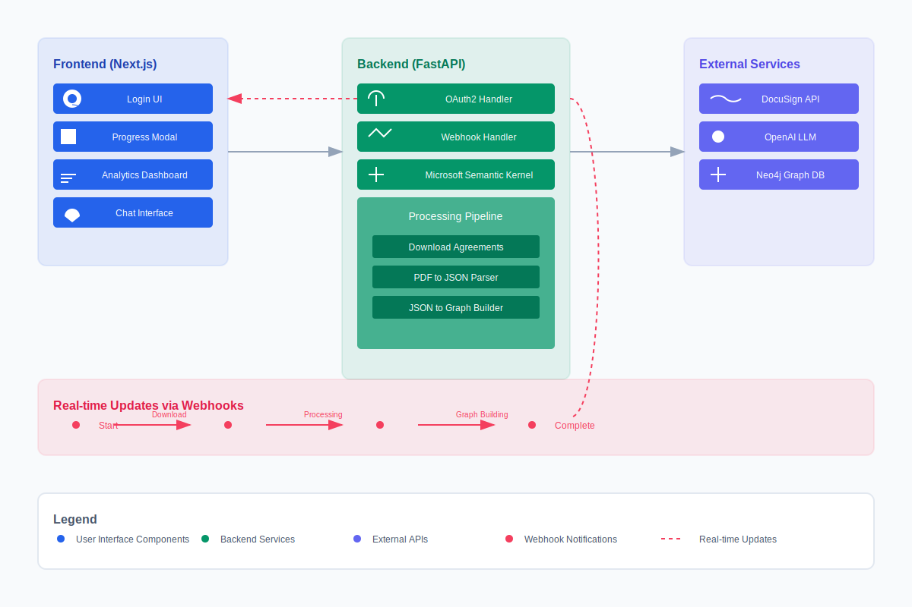

# Docu Watch

An application that leverages DocuSign, OpenAI, Microsoft semantic-kernel and Neo4j to provide intelligent contract analysis and a context-aware chatbot interface.

## 🏗️ Architecture



## 🎥 Demo Video

[](https://www.youtube.com/watch?v=5giTCyTuFqc)

[Watch the full demo on YouTube](https://www.youtube.com/watch?v=5giTCyTuFqc)

## 🌟 Key Features

- **DocuSign Integration**: Seamless OAuth2 authentication and document retrieval using Docusign eSignature REST API
- **Intelligent Processing**: Automated contract analysis using OpenAI's assistant api and Microsoft's Semantic Kernel
- **Real-time Updates**: Webhook-based progress tracking for background tasks
- **Graph-based Knowledge**: Neo4j-powered contract relationship mapping
- **Interactive Chat**: Context-aware contract query system

## 🛠️ Tech Stack

### Frontend
- **Next.js**
- **ShadcN UI**
- **Tailwind**

### Backend
- **Webhooks**: Real-time progress updates
- **FastAPI**
- **Microsoft Semantic Kernel**: Advanced LLM integration
- **OpenAI**
- **Neo4j**: Graph database for contract relationships
- **Docusign eSignature REST API**: Document handling and OAuth2

## 📦 Project Structure

```
.
├── apps/
│   ├── frontend/           # Next.js frontend application
│   └── backend/           # FastAPI backend application
├── package.json          # Root package.json for monorepo
└── pnpm-workspace.yaml   # PNPM workspace configuration
```

## 🔄 Process Flow

1. **Authentication**
   - OAuth2-based DocuSign login
   - Access token and account ID retrieval

2. **Document Processing**
   - Downloads completed agreements (past 3 days)
   - Converts PDFs to structured JSON
   - Builds graph relationships

3. **Analysis Features**
   - Contract parties identification
   - Risk assessment
   - Obligation tracking
   - Governing law analysis
   - Industry pattern recognition

## 🤖 ChatBot Capabilities

The system includes a sophisticated chatbot that:
- Leverages graph database for contextual awareness
- Provides precise contract-specific answers
- Understands relationships between different agreements
- Offers insights based on historical patterns

## 📋 API Documentation

### Authentication Endpoints
```python
GET /login                 # Initiate DocuSign OAuth flow
GET /callback              # Handle OAuth callback
```

### Chat Endpoints
```python
POST /chat/               # Send message and get AI response
DELETE /chat/history      # Clear chat history for current user
```

### Envelope/Document Endpoints
```python
GET /envelopes/           # Get completed envelopes and trigger processing
GET /envelopes/json_files # Get processed JSON files
GET /envelopes/{envelope_id}/documents          # List envelope documents
GET /envelopes/{envelope_id}/documents/{document_id}/download  # Download document
```

## 💻 Development Setup

### Prerequisites
- PNPM package manager
- Poetry (Python dependency management)

```bash
cd docusign-contract-analysis

# Install dependencies (both frontend and backend)
pnpm run monorepo-setup

# Set up environment variables
cp apps/backend/.env.example apps/backend/.env
cp apps/frontend/.env.example apps/frontend/.env

# Start development servers
pnpm run dev  # Starts both frontend and backend servers
```

## 🔑 Environment Variables

see `.env.example` inside
- apps/frontend/
- apps/backend/


## 📝 License

This project is licensed under the MIT License - see the [LICENSE](LICENSE) file for details.
